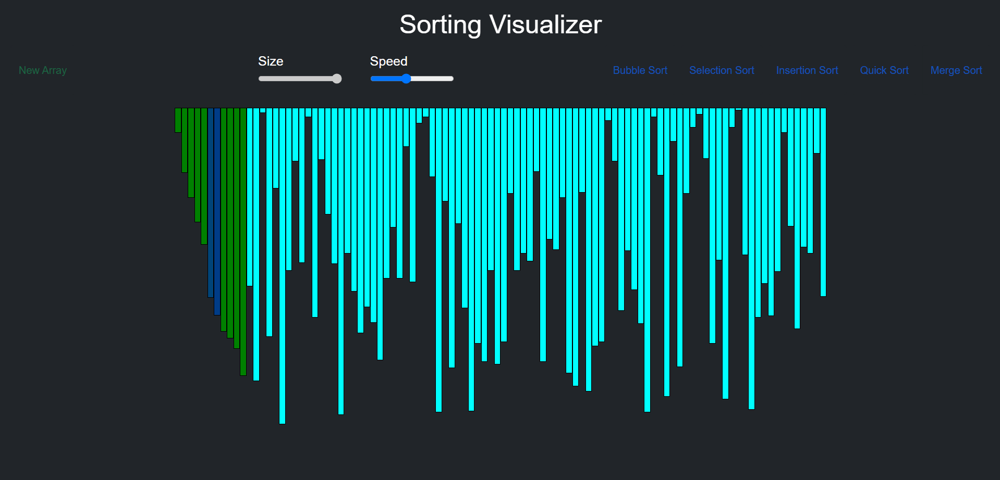

# Sorting Visualizer
### Web application for visualizing a bunch of different sorting algorithms like Selection Sort, Merge Sort, Quick Sort, etc. with the functionality of (Processing Speed Control) and (Array Size Control)  

### This is built using HTML, CSS, JavaScript  

  

